# Azure Database Migration Project

The main goal of this project was to design and implement a cloud-based database system on the Microsoft Azure platform. I started it off by setting up a GitHub repository (azure-database-migration562) and an Azure environment, followed by connecting to a Virtual Machine via Windows Remote Desktop and creating a production database.

I successfully migrated a local database to Azure, ensuring data integrity throughout the process with careful planning and validation. The additional milestones focused on securing data through backups and establishing a development database, allowing for safe testing without compromising the main production data.

Further progress involved simulating disaster recovery scenarios, setting up geo-replication for enhanced data resilience, and integrating Microsoft Entra ID for improved security.

## Milestone 1 and Milestone 2: Initial Setup / Configuration

### Azure Virtual Machine (VM) Deployment

- **VM Name:** production-vm
- **VM Size:** Standard Ds2 v3
- **VM vCPUs:** 2
- **VM RAM:** 8GB
- **Operating System:** Windows 11 Pro

### Establishment of Remote Desktop Connection

Utilising the RDP protocol, I established a secure connection to the Azure VM via Microsoft Remote Desktop.

### Production Database Setup

To replicate a production-like scenario, I have downloaded the AdventureWorks backup file (AdventureWorks2022.bak), ensuring it resides in the backup "Program Files" location: C:\Program Files\Microsoft SQL Server\MSSQL16.SSQLSERVER\MSSQL\Backup\AdventureWorks2022.bak.

Subsequently, I also successfully restored the AdventureWorks database on the Azure VM.

These milestones set the foundation of the rest of the project.

## Milestone 3: Migrate to Azure SQL Database

The focus of Milestone 3 was to transition the on-premise database to Azure by migrating it to an Azure SQL Database. This involved a series of tasks to ensure both the schema and data were successfully transferred, using Azure Data Studio.

### Task 1: Set Up Azure SQL Database

I started this task by creating an Azure SQL Database named "production-database". The associated SQL Server, "production-database-server.database.windows.net", was configured to use SQL Login for authentication. I also included by IP address to the firewall settings, to allow secure access.

### Task 2: Prepare for Migration

Azure Data Studio was installed and configured on the production Windows VM, to ensure a  connection to the existing on-premise / local database.

### Task 3: Connect to Azure SQL Database

Using Azure Data Studio, I established a connection to the newly created Azure SQL Database.

### Task 4: Schema Migration

Upon connecting to both databases, I installed the SQL Server Schema Compare extension n Azure Data Studio. This  allowed me to compare the schemas of the two databases. I then proceeded to migrate the schema from my local database to the Azure SQL Database without any issue.

### Task 5: Data Migration

With the schema successfully migrated, the next step was to move the data. I used the Azure SQL Migration extension to handle the data transfer process.

### Task 6: Validate Migration Success

To verify the migration's success, I conducted a thorough validation of the data, schema, and configurations in the migrated Azure SQL Database to ensure data integrity and that all components were functioning as expected.

### Migrated Data (Example Query)

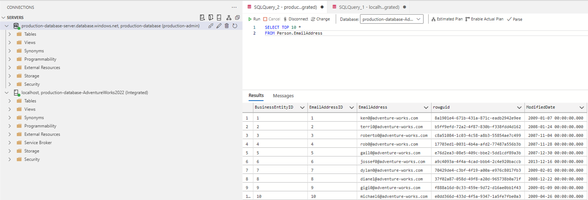

### Local Data (Example Query)

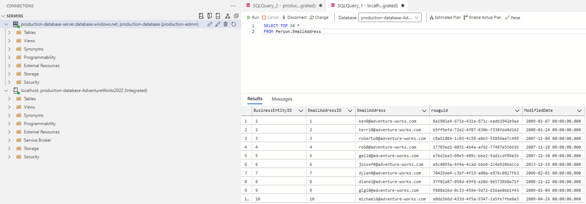

## Milestone 4: Data Backup and Restore

 The focus here was to ensure the safety of the data stored in the production database making use of the distinction between production and development environments. Now that I have created a development database, I can experiment changes without risking the integrity of the main production data.

### Task 1: Backup the On-Premise Database

A full backup of the production database, "production-database", was successfully created from the Windows VM, "production-vm". The backup file was stored securely at "C:\Program Files\Microsoft SQL Server\MSSQL16.MSSQLSERVER\MSSQL\Backup" on the VM.

### Task 2: Upload Backup to Blob Storage

An Azure Blob Storage account, "developmentstorage562", was configured to serve as the online repository for the database backups. The backup file was then uploaded to the Blob Storage container, "development-container-1".

### Task 3: Restore Database on Development Environment

A new Windows VM, "development-vm", was created to simulate the development environment. SQL Server was then installed and the backup from the production environment was restored onto this VM.

### Task 4: Automate Backups for Development Database

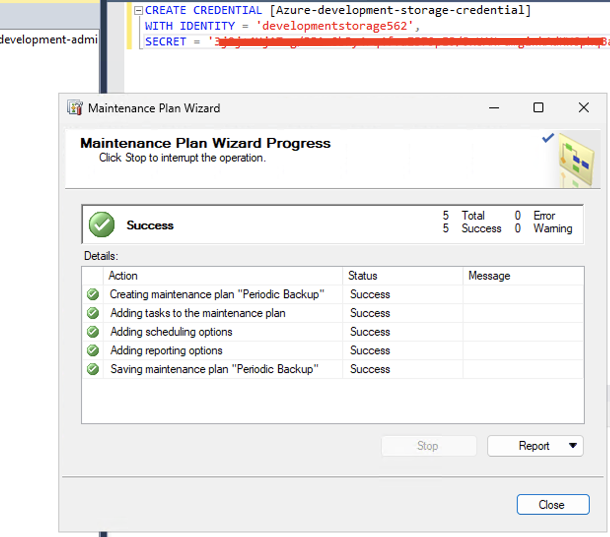

Within the development environment, SSMS was used to set up an automated weekly backup system by using a management task to perform weekly backups. These backups are stored at "https://developmentstorage562.blob.core.windows.net/development-container-1", ensuring that it could be restored at anytime necessary.

## Milestone 5: Disaster Recovery Simulation

In milestone 5, I tested the quality of the data backup and restore procedure for the production environment hosted on Azure by simlulating an accidental deletion of important data.

### Task 1: Mimic Data Loss in Production Environment

I began by removing critical data from the production database (110 rows).

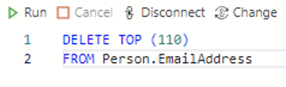

Below is the total number of rows before and after deleting rows from a table called Person.EmailAddress:

#### Before Deletion

#### After Deletion

### Task 2: Restore Database from Azure SQL Database Backup

The simulated data loss removed the top 110 entries, creating a simulated disaster scenario. In order to rectify this and retrieve the lost data, the SQL database was restored using Point-in-Time recovery in Azure to revert it to a backup state from 12 hours ago. The total number of rows went back to the original 19,972 rows:

## Milestone 6: Geo-Replication and Failover

In milestone 6, I set up Azure SQL Database geo-replication and conducted failover tests which ensures availability through a secondary database in a different region (located in the US) for the purpose of simulating a real-world disruption.

### Task 1: Set Up Geo-Replication for Azure SQL Database

I established a replica of the primary database (production-database) on a separate SQL server (production-replication-server). This server is strategically located in a different geographical region (South Central US).

### Task 2: Test Failover and Tailback

In task 2, a planned failover to the secondary region in the US was executed, followed by a tailback to the primary region in the UK.

#### Failover

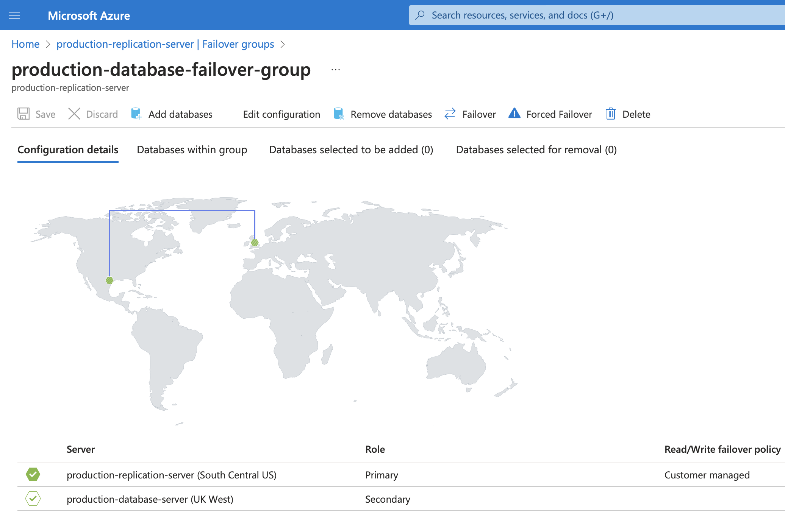

#### Tailback

#### Failover Progress

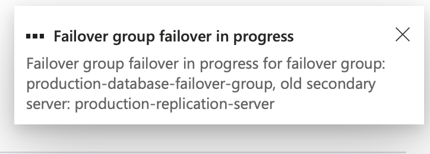

#### Failover Success

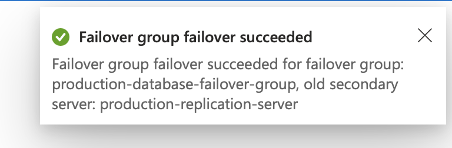

## Milestone 7: Microsoft Entra Directory Integration

In milestone 7, I integrated Microsoft Entra ID with my Azure SQL Database setup. After that, I created a read-only user, named "database_reader" in Azure Data Studio, using a specific SQL query to assign them the read-only status:

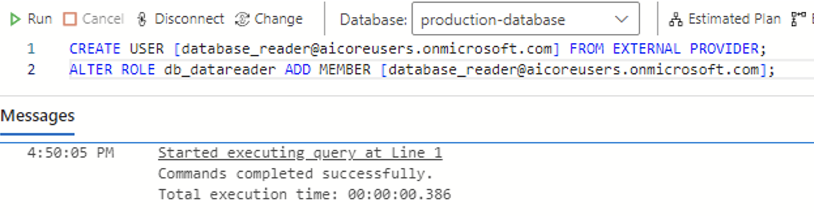

Next, I connected to my production database using Azure Data Studio and the credentials of the new Database_Reader Entra user:

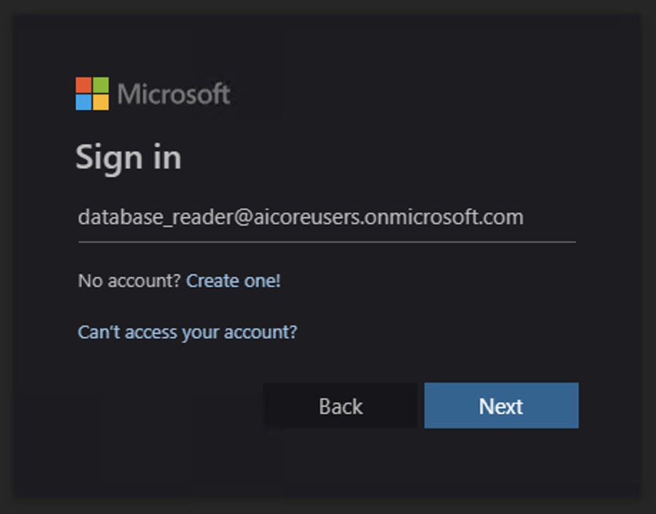

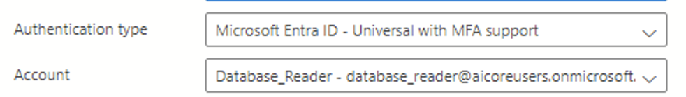

#### Testing "Non-Read" Permissions:

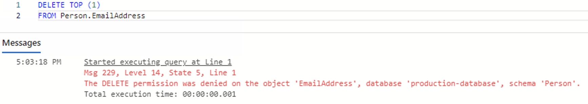

## Azure UML Diagram

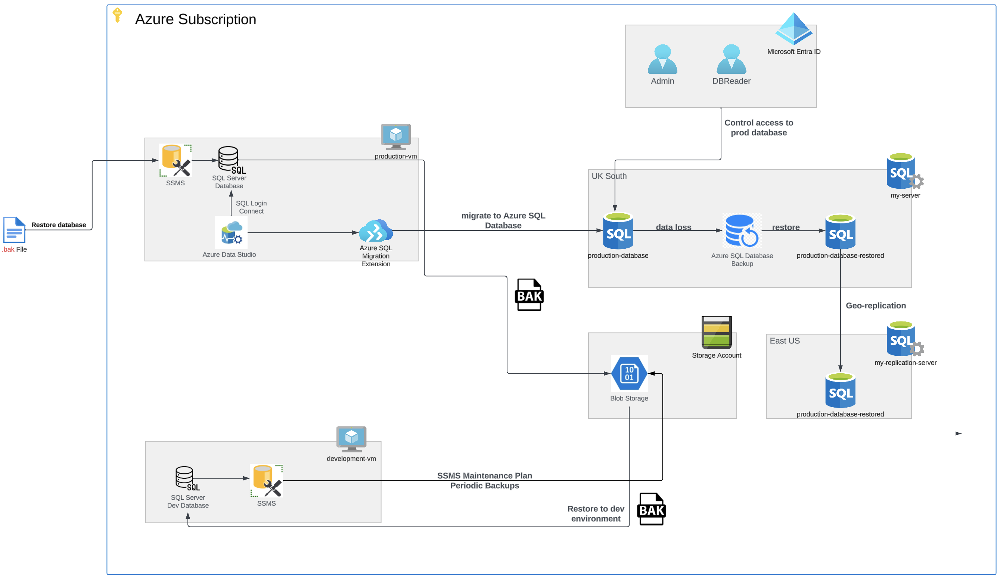

## Gained Knowledge and Reflections

- I have understood even clearer cloud database migrations in Azure, including transferring schema and data.
- The crucial role of regular backups and effective restoration in securing data.
- Simulating and managing disaster recovery scenarios to maintain data integrity and availability.
- The benefits of geo-replication for data protection and minimising downtime during disruptions.
- Implementing Microsoft Entra Directory to secure database access management.